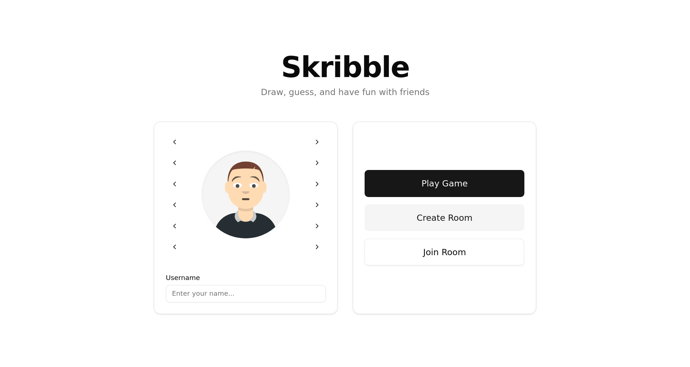

# Skribble

> A real-time multiplayer drawing and guessing game built with React, Bun, and Socket.io.

[](https://opensource.org/licenses/MIT)

## Why This Exists

Skribble is a modern, fast, and responsive web-based multiplayer drawing game. It provides a seamless real-time experience where players can create rooms, draw words, and guess what others are drawing, all powered by WebSockets.

## 📸 Screenshots


<br />
*The Skribble main landing page where you can join or create a game.*

## Quick Start

The fastest way to get Skribble running locally.

### 1. Start the Backend

```bash
cd backend
bun install
bun run index.ts
```

### 2. Start the Frontend

```bash
cd frontend
npm install
npm run dev
```

Open [http://localhost:3000](http://localhost:3000) in your browser.

## Architecture & Tech Stack

Skribble is a monorepo consisting of a frontend web client and a backend WebSocket server.

### Frontend
- **Framework**: React 19 + Vite
- **Routing**: TanStack Router
- **Styling**: Tailwind CSS v4 + Shadcn UI
- **Real-time**: Socket.io-client
- **Tooling**: Biome (Linting/Formatting), Vitest

### Backend
- **Runtime**: Bun
- **Server**: Express + Socket.io
- **Language**: TypeScript

## Installation

**Prerequisites**: 
- [Node.js](https://nodejs.org/) 20+ (for frontend)
- [Bun](https://bun.sh/) 1.0+ (for backend)

### Backend Setup

```bash
cd backend
bun install
```

### Frontend Setup

```bash
cd frontend
npm install
```

## Usage

### Running Locally

You need to run both the frontend and backend servers simultaneously.

**Terminal 1 (Backend):**
```bash
cd backend
bun run index.ts
```
*The backend server runs on port 3001 by default.*

**Terminal 2 (Frontend):**
```bash
cd frontend
npm run dev
```
*The frontend development server runs on port 3000.*

### Game Flow

1. **Enter Name**: Choose an avatar and enter your display name.
2. **Join/Create Room**: Create a new private room or join an existing one using a room code.
3. **Play**: 
   - When it's your turn, choose a word and draw it on the canvas.
   - When others are drawing, type your guesses in the chat.
   - Earn points for guessing correctly and quickly!

## Configuration

### Frontend Environment Variables

Create a `.env` file in the `frontend` directory based on `.env.example`:

```env
VITE_BACKEND_URL=http://localhost:3001
```

| Variable | Description | Default |
|----------|-------------|---------|
| `VITE_BACKEND_URL` | The URL of the WebSocket backend | `http://localhost:3001` |

## Contributing

1. Fork the repository
2. Create your feature branch (`git checkout -b feature/amazing-feature`)
3. Commit your changes (`git commit -m 'Add some amazing feature'`)
4. Push to the branch (`git push origin feature/amazing-feature`)
5. Open a Pull Request

Please ensure your code passes linting by running `npm run check` in the frontend directory.

## License

MIT © [Gurkirxt](https://github.com/Gurkirxt)
